<div align="center">
  


### `Backend Engineer` · `ML Systems` · `Distributed Systems`

*Building production backends and ML systems that ship.*

[](https://git.io/typing-svg)

</div>

---

<div align="center">

[](https://www.linkedin.com/in/princekhatri1013)
[](mailto:princekhatri1013@gmail.com)
[](https://github.com/Prince-Khatri)


</div>

---

> Information Science Engineering student at **Ramaiah Institute of Technology, Bengaluru** — focused on scalable backend systems and applied machine learning.

I work on systems where correctness and structure matter: service boundaries, data flow, and models that are trained, tracked, and served — not just notebook demos.

- **Currently:** Designing Spring Boot microservices and end-to-end ML pipelines
- **Focus:** Distributed backends, event-driven design, and ML model serving

---

## Featured Projects

### [`SeatNova`](https://github.com/Prince-Khatri/SeatNova) — Movie Ticket Booking Platform
> Microservices booking system with distributed seat locking, async payments, and a secured API gateway.

- Seven Spring Boot services for movies, theatres, bookings, and payments — routed through Eureka and a centralized config server
- Seat holds enforced in Redis with Lua scripts to prevent double-booking under concurrency
- Booking and payment state kept in sync over RabbitMQ; Razorpay webhooks confirm payments asynchronously
- API Gateway validates JWTs from Keycloak (OAuth 2.0 + PKCE) before forwarding traffic
- Each domain service owns its own PostgreSQL schema

`Java` `Spring Boot` `Spring Cloud` `Eureka` `Redis` `RabbitMQ` `PostgreSQL` `Razorpay` `Keycloak`

---

### [`CafeOps`](https://github.com/mrsahiljaiswal/CafeOPS) — POS with Demand Forecasting
> Full-stack point-of-sale platform that predicts meal demand and keeps inventory aligned with real orders.

- Spring Boot REST API for orders, meals, inventory, and forecast endpoints; React + Vite frontend for POS and analytics
- Orders deduct ingredients from center inventory using recipe mappings and unit conversion
- Python ML service (LightGBM) forecasts demand; backend calls it over HTTP and surfaces model vs. actual metrics
- Training and prediction pipelines with preprocessing artifacts; experiment tracking via MLflow
- Docker Compose brings up PostgreSQL, backend, ML service, and frontend as one stack

`Java` `Spring Boot` `PostgreSQL` `React` `LightGBM` `Flask` `MLflow` `Docker`

---

### [`Cartora`](https://github.com/Prince-Khatri/Cartora-E-Commerce-Platform) — E-Commerce Product Backend
> Spring Boot product API with cloud object storage for catalog images.

- REST endpoints for product create, update, delete, and listing with JPA persistence
- Product images uploaded and removed through AWS S3 (AWS SDK v2)
- Multipart image handling wired into the product lifecycle so catalog media stays consistent with DB state

`Java` `Spring Boot` `Spring Data JPA` `AWS S3` `REST APIs`

---

### [`Next Word Predictor`](https://github.com/Prince-Khatri/Next-Word-Predictor) — LSTM Language Model
> End-to-end next-word prediction: train an LSTM, track runs in MLflow, serve suggestions over a Flask API.

- Modular pipeline for ingestion, tokenization, training, and inference — config-driven via YAML
- LSTM with embedding and dropout, trained with early stopping; experiments logged in MLflow
- Flask service returns next-token predictions for a notepad-style UI (Space for hint, Tab to accept)
- Top-k sampling at inference for controlled, non-greedy completions

`Python` `TensorFlow` `Keras` `LSTM` `MLflow` `Flask` `NumPy`

---

## Tech Stack
<div align="center">

| Domain | Technologies |
|--------|-------------|
| **Languages** | Java · Python · SQL · C++ |
| **Backend** | Spring Boot · Spring Cloud · REST APIs · Flask |
| **Data & Messaging** | PostgreSQL · Redis · RabbitMQ · H2 |
| **ML / AI** | TensorFlow · Keras · LightGBM · NumPy · Pandas · Scikit-Learn · MLflow |
| **Cloud & Infra** | AWS S3 · Docker · Eureka · Keycloak |
| **Frontend** | React · Vite |
| **Tools** | Git · Linux · Maven · Jupyter |

</div>


---
## 📊 GitHub Stats

<table align="center">
  <tr>
    <td align="center">
      
    </td>
    <td align="center">
      
    </td>
  </tr>
  <tr>
    <td colspan="2" align="center">
      
    </td>
  </tr>
</table>

---


## What I'm Working Toward

```
[x] End-to-end ML pipeline (data → training → serving)
[ ] Harden distributed booking flows under real load
[ ] Deeper work on systems design and ML at scale
```

---

<div align="center">

*"The best way to understand an algorithm is to implement it yourself."*

**Open to internships, collaborations, and interesting problems.**

[](https://www.linkedin.com/in/princekhatri1013)
[](mailto:princekhatri1013@gmail.com)

</div>
